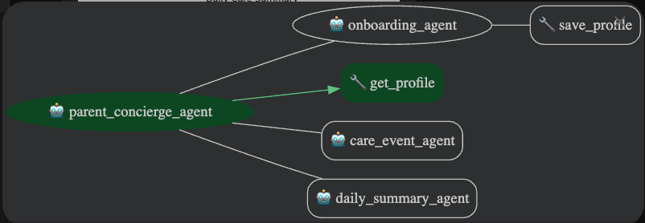

# Parent Concierge Capstone Project Report

*A submission for the 2025 Agents Intensive - Capstone Project*

> **Track:** Concierge Agents  
> **Author:** Daniel Parkin  
> **Repository:** *(insert GitHub public repo link)*  


---

# 1. Overview
Parenting a newborn involves constant information tracking, consisting of feeds, naps, diapers, milestones, questions for healthcare professionals all scattered across apps, notes, and memory. This makes it difficult to track trends or spot potential health issues amidst the chaos.

**Parent Concierge** is a multi-agent system built with the **Google ADK (Python)** that acts as a personalised assistant for new parents. It automates the logging, summarisation, and interpretation of baby-care events, providing daily insights, summaries, and data-driven context.

---

# 2. Problem Statement
New parents must track feeds, naps, diapers, symptoms, and behaviours often multiple times per hour. These logs matter for:
- Identifying health issues
- Establishing routines
- Communicating with doctors
- Managing sleep and feeding strategies

**Current apps are manual and lack the logic to answer questions about the data.** They also lack multi-modal summaries, proactive insights, or the ability to answer natural language questions.

**The problem:** Parents need a simple, intelligent system that *automatically* organises baby-care events and produces meaningful summaries and recommendations.

---

# 3. Solution Summary
Parent Concierge is a **multi-agent system** that turns scattered notes into clear, useful daily summaries.

### Core Features
- **Onboarding Agent** creates and stores a baby profile.
- **Care Event Agent** captures and validates feed/nap/diaper events.
- **Daily Summary Agent** transforms all daily events into a structured narrative.
- **Summary Output Agent** formats final summaries for parents.
- **Parallel Summary Team** evaluates specific aspects of the day concurrently.
- **Memory** uses an InMemorySessionService for continuity.
- **Tools** custom data stores and plotting features.
- **Observability** structured logging.

---

# 4. Architecture

## 4.1 High-Level Diagram


## 4.2 Agents
### **Parent Concierge Agent**
- Entry point for the user.
- Routes messages to the appropriate sub-agent.
- Manages session context.

### **Onboarding Agent**
- Creates the baby profile (name, DOB, feeding style, etc.).
- Uses a custom profile store tool.

### **Care Event Agent**
- Classifies the type of event (feed, nap, diaper).
- Validates inputs.
- Stores events via a dedicated tool.

### **Daily Summary Agent**
- Gathers all recorded events for the day.
- Creates structured summary objects.

### **Parallel Summary Team**
- Compute Stats Agent
- Narrative Summary Agent
- Visualizations Agent.
- Each runs concurrently via ADK parallel agent patterns.

### **Summary Output Agent**
- Combines outputs from the team.
- Produces parent-friendly narrative.
- Generates optional charts (Matplotlib with icon overlays).

---

# 5. Key Technical Concepts Demonstrated

## ✔ Multi-Agent System
- 6 agents + 1 parallel team
- Sequential orchestration + parallel execution

## ✔ Tools
- Custom tools: `baby_profile_store`, `care_log_store`, `summary_plotter`
- Built-in tools: code execution for chart generation

## ✔ Sessions & Memory
- InMemorySessionService for persistent session state
- Local JSON files for persistent user data storage

## ✔ Observability
- Logging for: event capture, routing, summarisation

---

# 6. Tools
### **Custom Tools Implemented**
| Tool | Purpose |
|------|---------|
| `BabyProfileStore` | Create/update profile, fetch profile |
| `CareLogStore` | Append care-event records + retrieve logs |
| `VisualizationsTool` | Matplotlib graph with overlay icons |

---

# 7. Implementation Details

## 7.1 Folder Structure
```
parent_concierge/
│
├── parent_concierge_agent.py
├── cli_main.py
│
├── subagents/
│   ├── onboarding_agent.py
│   ├── care_event_agent.py
│   ├── care_event_fetcher.py
│   ├── daily_summary_agent.py
│   ├── summary_output_agent.py
│   └── parallel_summary_team.py

│
├── tools/
│   ├── baby_profile_store.py
│   ├── care_log_store.py
│   └── visualizations_tools.py
│
└── assets/
    ├── feed_icon.png
    ├── nap_icon.png
    └── diaper_icon.png
```

## 7.2 Core Technologies
- **Python 3.13**
- **Google ADK** (agents, memory, tools)
- **Matplotlib** for charts

---

# 8. Setup Instructions

## Install Dependencies
```bash
pip install -r requirements.txt
```

## Create an `.env` file
```
echo "GEMINI_API_KEY=ABC123" >> .env
```

## Run the Agent Locally
```bash
python -m parent_concierge.cli_main
```

## Web UI
```bash
adk web
```

---

# 9. Example Usage
### **1. Start the system: New user**
```text
Hello! I'm here to help you set up your baby's profile.

First, could you please tell me your name?
```
### **2. Start the system: Existing user**
```text
Hello Stephen! Great to see you. How can I help you and Leo today?
```
### **3. Add a feed**
```
"Leo had 120ml of formula at 2:10pm"
```
### **4. Daily summary**
```
"How was today?"
```
Returns a narrative + optional chart.

---

# 10. Limitations & Future Work
### Current limitations
- Local-only memory store
- No reminders or push system
- No integration with wearables or baby monitors

### Future enhancements
- Prediction models (sleep/wake/feeding trends)
- Multi-child profiles
- Cloud memory backend
- Web dashboard & embeddable charts
- Health-visitor export PDF

---

# 11. Conclusion
Parent Concierge demonstrates a complete multi-agent architecture that assists new parents with daily childcare logs, summaries, and actionable insights. It uses a wide range of ADK features: agents, tools, memory, observability, and all core Capstone criteria.

